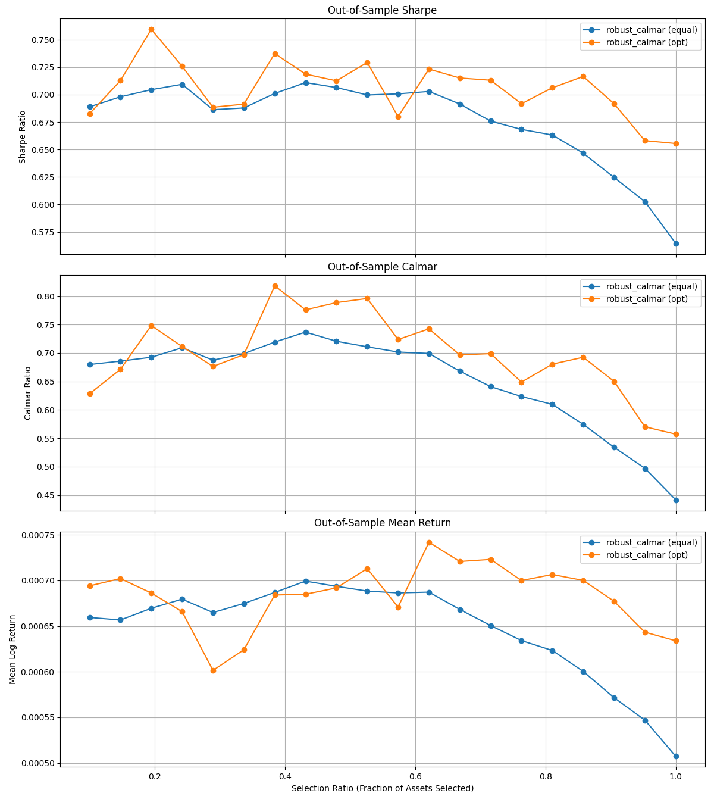

# 🧠 EvoRisk: Autonomously Discovered Regime-Adaptive Resilience-Aware Financial Metric

**EvoRisk** is an autonomously discovered, regime-adaptive, and resilience-aware performance metric that generalizes classical ratios such as **Sharpe** and **Calmar**.  It models **volatility asymmetry**, **tail risk**, and **drawdown persistence** under non-stationary market regimes — providing a robust signal for **asset selection** and **portfolio optimization**. Developed within an **AlphaEvolve-style AlphaSharpe framework**, EvoRisk was evolved autonomously through iterative generation, mutation, scoring, and selection — merging LLM creativity with empirical validation.

---

## 🧮 Methodological Summary

EvoRisk was autonomously discovered using **AlphaEvolve** —  a large-language-model (LLM)–driven system for machine-assisted scientific discovery. It extends the **AlphaSharpe** lineage to produce a **volatility- and drawdown-aware metric** that generalizes traditional ratios (Sharpe, Sortino, Calmar) to non-stationary, heavy-tailed regimes. EvoRisk defines a **regime-adaptive risk metric** that integrates volatility, drawdown, and tail dynamics.

**Core components:**
- Adaptive multi-horizon volatility estimation (winsorized, dynamically blended)
- Jump variance and volatility persistence (GARCH-like)
- Bayesian regime regularization to prevent overreaction
- Tail-entropy penalization for heavy-tailed losses
- Depth-weighted drawdown persistence modeling

When used for both **asset selection** and **portfolio optimization**, EvoRisk achieves:
- **+32–36 % higher Sharpe**
- **+80–60 % higher Calmar**
- **+40–60 % higher mean return**
over equal-weighted portfolios.

---

## 🚀 Features

- **Robust Financial Metrics**
  - `alpha_sharpe()`: volatility-aware Sharpe-like ratio using downside and forecasted volatility.
  - `robust_calmar()`: volatility-adaptive, jump-aware, entropy-regularized drawdown metric (EvoRisk core).

- **Portfolio Optimization**
  - Inverse-covariance Bayesian projection for signal-weighted allocations.
  - Combines signal strength with covariance orthogonalization.

- **Evaluation Framework**
  - Time-series cross-validation for 15-year equity dataset.
  - Out-of-sample evaluation of Sharpe, Calmar, and mean log-returns.
  - Dual evaluation modes: *selection* (ranking) and *optimization* (allocation).

- **Visualization**
  - Comparative Sharpe, Calmar, and mean-return curves across selection ratios.

---

## 💻 Usage

1. Place a dataset file named **`Dataset.pkl`** in the project root.  
   It should contain a NumPy array of shape `(assets, timesteps)`  
   with **daily log returns** for each asset.

2. Run the main script:
```bash
python evorisk.py
```

3. The script will:
   - Load and split your dataset into train/test sets (80/20).  
   - Compute EvoRisk (`robust_calmar`) and AlphaSharpe-like (`alpha_sharpe`) scores.  
   - Rank assets and evaluate out-of-sample portfolio performance.  
   - Print results to the console and generate comparative performance plots.

---

## 📊 Example Output

```
===== Out-of-Sample Performance by Selection Ratio =====

 Selection_Ratio  Calmar_EQ_Sharpe  Calmar_EQ_Calmar  Calmar_EQ_Return  Calmar_OPT_Sharpe  Calmar_OPT_Calmar  Calmar_OPT_Return
            0.2             0.7045             0.6926            0.0007             0.7595             0.7484            0.0007
            0.4             0.7011             0.7193            0.0007             0.7375             0.8184            0.0007
            0.5             0.6997             0.7110            0.0007             0.7293             0.7960            0.0007
            1.0             0.5646             0.4417            0.0005             0.6555             0.5573            0.0005
```

📈 The script also produces visualizations:

- **Sharpe vs Selection Ratio**  
- **Calmar vs Selection Ratio**  
- **Mean Log Return vs Selection Ratio**

Each chart compares:
- `robust_calmar (equal)` vs `robust_calmar (optimized)` allocations.



---

## 📘 Citation

If you use this repository in your research, please cite:

```bibtex
@article{Yuksel2025EvoRisk,
  title   = {EvoRisk: Autonomously Discovered Regime-Adaptive Resilience-Aware Financial Metric},
  author  = {Kamer Ali Yuksel and Hassan Sawaf},
  year    = {2025},
  journal = {aiXplain Research Preprint},
  note    = {arXiv submission forthcoming}
}
```

---

## 👨‍💻 Authors

**Kamer Ali Yuksel** — Head of Agentic AI, aiXplain Inc.  

---

## References

1. **AlphaQuant**: LLM-Driven Automated Robust Feature Engineering for Quantitative Finance. In *Proceedings of the Thirteenth International Conference on Learning Representations (ICLR 2025)*, Singapore. Available at SSRN: [https://ssrn.com/abstract=5124841](https://ssrn.com/abstract=5124841).

3. **AlphaSharpe**: LLM-Driven Discovery of Robust Risk-Adjusted Metrics. Preprint, [arXiv:2502.00029](https://arxiv.org/abs/2502.00029).
